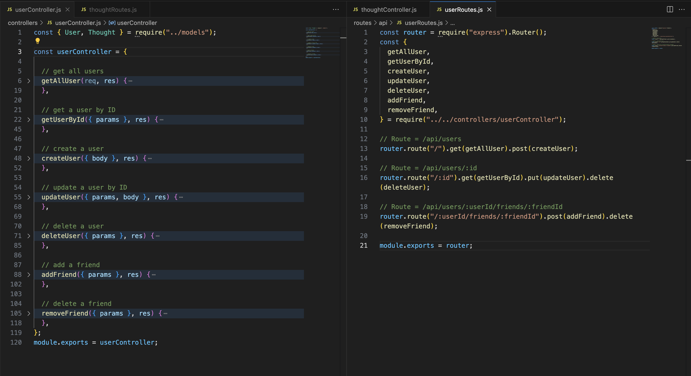
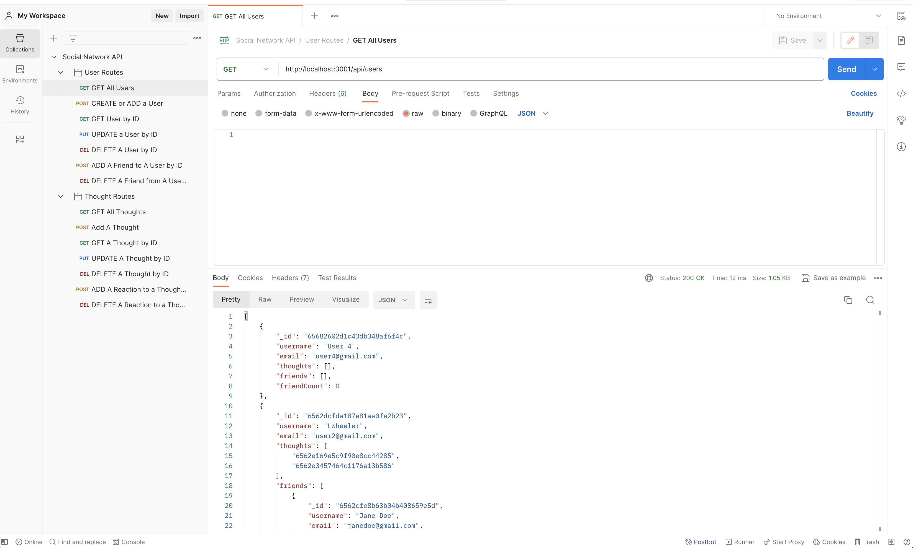

# social-network-api
Bootcamp Module 18: NoSQL Challenge - Social Network API

## NoSQL Challenge: Social Network API
In this project, we were asked to build an API for a social network web application where users can share their thoughts, react to friends’ thoughts, and create a friend list. We used Express.js for routing, a MongoDB database, and the Mongoose ODM. In addition to using the Express.js and Mongoose packages, we also used a JavaScript date library or the native JavaScript Date object to format timestamps.

## Table of Contents

- [URLs Submitted](#urls-submitted)
- [References/Resources](#references-and-resources)
- [User Story](#user-story)
- [Acceptance Criteria](#acceptance-criteria)
- [Screenshots](#screenshots)
- [Contact Me](#contact-me)

## URLs Submitted:

* My GitHub Repo URL: https://github.com/lenzlee/social-network-api 

* Video Walk-Through: https://www.awesomescreenshot.com/video/22908975?key=f22ef9cad4bb968d48d12b179d912ddd 

## References and Resources: 

I mostly used our Module 18 lessons for this assignment. I also referred to the following resources: 

* express.js: https://www.npmjs.com/package/express

* Mongoose: https://www.npmjs.com/package/mongoose 

* dateFormat.js: https://www.npmjs.com/package/dateformat

## User Story:

```

AS A social media startup

I WANT an API for my social network that uses a NoSQL database

SO THAT my website can handle large amounts of unstructured data

```

## Acceptance Criteria:

```

GIVEN a social network API
WHEN I enter the command to invoke the application
THEN my server is started and the Mongoose models are synced to the MongoDB database
WHEN I open API GET routes in Insomnia for users and thoughts
THEN the data for each of these routes is displayed in a formatted JSON
WHEN I test API POST, PUT, and DELETE routes in Insomnia
THEN I am able to successfully create, update, and delete users and thoughts in my database
WHEN I test API POST and DELETE routes in Insomnia
THEN I am able to successfully create and delete reactions to thoughts and add and remove friends to a user’s friend list

```

## Screenshots:

* VS Code Screenshot



* Postman Screenshot



## Contact Me

Lenzlee Wheeler at: https://github.com/lenzlee 